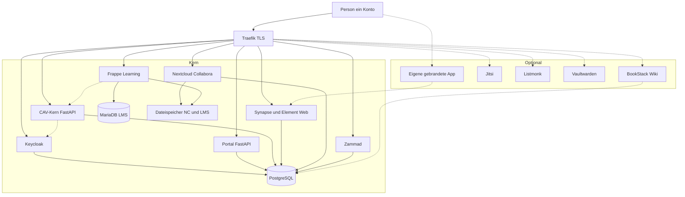

# Aeneas Planung

Planungsrepository für die Serverlandschaft eines **Gesamtvereins** mit mehreren Cannabis-Anbauvereinigungen nach dem KCanG.

Hier liegt die Architektur, nicht der Anwendungscode. Selbst geschrieben werden später nur **Portal** und **CAV-Kern** (FastAPI) plus ein kleiner Matrix-Gruppenabgleich. Der Rest ist fertige Software (Keycloak, Matrix, Zammad, Frappe Learning, Nextcloud) plus **optionale Overlays** (Wiki, Jitsi, eigene App, …).

## Zielbild in einem Satz

Ein Keycloak-Konto. Das Portal ist der Linktree. Fachliches (Abgabe, Anbau, Beitrag) im CAV-Kern. Chat in Matrix, Support in Zammad, Schulung in Frappe Learning (nicht Moodle), Office nur für Ämter in Nextcloud. Dieselbe Landschaft als **ein Verein allein** oder als **Gesamtverein**; Zweige können mit Datenpaket raus und wieder rein. Extra-Module nur als Overlay, nicht im Kern-Compose.

## Abbild: Kern und Optional

Durchgezogen = immer. Gestrichelt = Overlay, Verein schaltet ein oder lässt weg. Kein zweiter Stack.

| | Im Kern | Optional, abgegrenzt |
| --- | --- | --- |
| Dienste | Keycloak, Portal, CAV, Synapse + Element Web, Zammad, Frappe Learning, Nextcloud nur Amt | BookStack, Jitsi, Listmonk, Vaultwarden; später OpenSlides |
| Chat-Oberfläche | Element Web auf `chat.…`, SSO wie jetzt, Name/Logo in der Config | Eigene App: Desktop-Hülle, PWA, später Store-Build auf **demselben** Element, nicht Element X |
| Auth | Synapse-OIDC nach Keycloak | kein MAS nur für eine Store-App |

Details Overlays: [docs/optionale-module.md](docs/optionale-module.md). Erscheinungsbild: [docs/ci-cd.md](docs/ci-cd.md). Hosts und Compose: [docs/architektur.md](docs/architektur.md).

## Dokumente

| Datei | Inhalt |
| --- | --- |
| [docs/entscheide.md](docs/entscheide.md) | Festlegungen, was fertig vs. selbst |
| [docs/architektur.md](docs/architektur.md) | Hosts, Compose, Flussbild |
| [docs/sso-matrix.md](docs/sso-matrix.md) | SSO, Keycloak-Gruppen, Matrix-Spaces |
| [docs/fachkern.md](docs/fachkern.md) | Portal, CAV, Schnittstellen |
| [docs/mandanten.md](docs/mandanten.md) | Allein / Gesamtverein, ausgliedern, reimportieren |
| [docs/beitrag-sepa.md](docs/beitrag-sepa.md) | Tokens, Lastschrift, Einzahlung |
| [docs/tickets.md](docs/tickets.md) | Zammad |
| [docs/schulungen.md](docs/schulungen.md) | Frappe Learning, Mitwirkung, Dienst-Türen |
| [docs/optionale-module.md](docs/optionale-module.md) | Wiki, Git-nein, DMS=Nextcloud, eigene App, weitere Overlays |
| [docs/betrieb.md](docs/betrieb.md) | Linux, Backup, Größe, Testserver-Reihenfolge |
| [docs/ci-cd.md](docs/ci-cd.md) | Corporate Identity / Design je App |
| [docs/mail.md](docs/mail.md) | Kein Mailserver, Kontakt nach außen |
| [docs/repos-und-docker.md](docs/repos-und-docker.md) | Compose reicht; welche GitHub-Repos |

Go-Live (Klickweg, Reihenfolge): `aeneas_infra/SETUP.md`. Pitch und Architektur bleiben in diesem Repo.

## Nicht das Ziel

- Kein Nextcloud-Plugin als Abgabe, Helpdesk oder LMS
- Kein ERPNext als Mitgliederportal
- Kein Moodle / BBB / GitLab (zu schwer, zu viel RAM)
- Kein Git-Server und kein Forum für Mitglieder
- Kein zweites DMS neben Nextcloud (kein Paperless)
- Kein OpenDesk/Kubernetes als Einstieg
- Kein selbst gebautes Ticketsystem oder LMS
- Keine Garantie „KCanG-konform“ durch Software allein
