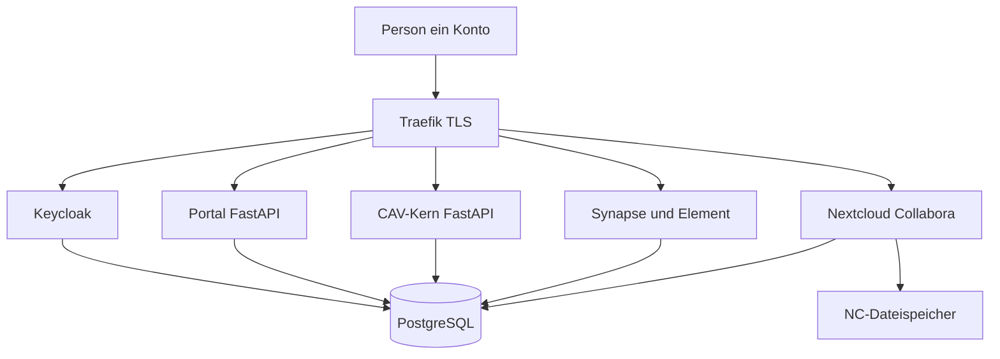

# Architektur

## Anfragefluss

Hervorgehoben als eigener Code: Portal, CAV-Kern, Gruppenabgleich Keycloak nach Matrix. Der Rest sind Container.

## Hosts

| Host | Dienst | Wer kommt rein |
| --- | --- | --- |
| `id.example` | Keycloak | alle Konten |
| `www.example` | Portal | alle Konten |
| `cav.example` | CAV-Kern | alle, Tenant und Rolle aus Token |
| `chat.example` | Element / Matrix | Mitglieder und Ämter |
| `cloud.example` | Nextcloud + Collabora | nur Backoffice-Gruppen |

Die echten Hostnamen stehen später in der Betriebsdokumentation, nicht in diesem Plan.

## Wer darf wohin

| Rolle | Portal / CAV | Matrix | Nextcloud + Collabora |
| --- | --- | --- | --- |
| Mitglied (nur Verein) | eigener Verein, eigene Belege | Allgemein + Bundesland + eigener Ort | nein |
| Vorstand Zweigverein | Amt im eigenen Tenant | wie Mitglied plus Vorstandsraum | ja |
| Ausgabe / Prävention / Anbau | jeweilige CAV-Funktion | Diensträume | ja, Dienstordner |
| Gesamtverein-Mitarbeiter | Mandantenwahl, keine Bestandsvermischung | Dachverband-Spaces | ja, zentrale Ablage |

## Docker Compose (Einstieg)

Ein Debian- oder Ubuntu-LTS-Host, kein Kubernetes.

| Container | Rolle | Logik |
| --- | --- | --- |
| traefik | HTTPS, Hosts | konfigurieren |
| keycloak + eigene DB | Konten, Gruppen, Client-Rechte | konfigurieren |
| synapse + element (+ MAS) | Chat, Spaces, keine Federation | konfigurieren |
| nextcloud + collabora + redis | Backoffice-Dateien, Kalender, Office | konfigurieren |
| portal | Start, Module, Mitglieder-PDFs | selbst schreiben |
| gruppenabgleich | Keycloak-Gruppen nach Matrix-Spaces | selbst schreiben |
| cav + worker | KCanG-Kern, Multi-Tenant | selbst schreiben |
| postgres / redis / restic | Daten, Jobs, Backup | konfigurieren |

Getrennte Datenbanken (oder mindestens getrennte Schemas) für Keycloak, Nextcloud, Synapse und CAV. Eine gemeinsame Postgres-Instanz am Anfang ist zulässig, solange die Daten nicht in einer Datenbank vermischt werden.

CAV spricht **nicht** mit Nextcloud, um Mitglieder-PDFs abzulegen. Vorstandsdateien entstehen in Nextcloud. Mitgliedsbelege erzeugt der CAV-Kern und zeigt sie im Portal unter Mein Konto (Beitrag, Tokens, PDFs).

Der monatliche Bankeinzug läuft nicht über die eigene Bank-API, sondern über einen Zahlungsdienstleister. Der CAV-Worker stößt den Einzug an und nimmt Webhooks entgegen; siehe [beitrag-sepa.md](beitrag-sepa.md).

## Mandanten

Ein CAV-Prozess, viele Zweigvereine. Jede fachliche Zeile trägt `verein_id`. Kein eigener Server pro Ortsverein.

Jedes Zweigverein ist rechtlich eine eigene Anbauvereinigung (eigene Erlaubnis, eigene 500er-Grenze, eigener Bestand, eigene Jahresmeldung). Software darf Bestände nicht vermischen, auch wenn der Gesamtverein die Plattform stellt.

## Frontends

Portal und CAV-Kern zuerst als FastAPI mit HTML-Templates, kein separates React-Frontend. Element und Nextcloud bringen ihre eigene Oberfläche mit.
