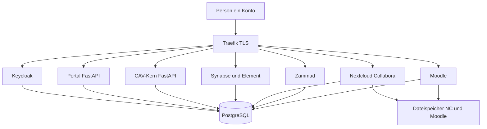

# Architektur

## Anfragefluss

Eigener Code nur: **Portal**, **CAV-Kern**, **Matrix-Gruppenabgleich**. Alles andere fertige Software hinter demselben Keycloak.

## Hosts

| Host | Dienst | Wer kommt rein |
| --- | --- | --- |
| `id.example` | Keycloak | alle Konten |
| `www.example` | Portal | alle Konten |
| `cav.example` | CAV-Kern | alle, Tenant und Rolle aus Token |
| `chat.example` | Element / Matrix | Mitglieder und Ämter |
| `help.example` | Zammad | alle (Mitglied = Kunde, Amt = Agent nach Gruppe) |
| `learn.example` | Moodle | alle aktiven Mitglieder |
| `cloud.example` | Nextcloud + Collabora | nur Backoffice-Gruppen |

## Wer darf wohin

| Rolle | Portal / CAV | Matrix | Zammad | Moodle | Nextcloud |
| --- | --- | --- | --- | --- | --- |
| Mitglied | eigener Verein, Belege | Allgemein + Land + Ort | eigene Tickets | Kurse / Jahresschulung | nein |
| Vorstand | Amt im Tenant | plus Vorstand | Agent + eigene Aufgaben | plus Amtskurse | ja |
| Ausgabe / Prävention / Anbau | CAV-Funktion | Diensträume | je nach Gruppe | Pflicht + Amt | ja |
| Gesamtverein-Mitarbeiter | Mandantenwahl | Dachverband | globale Queue | Kursadmin | ja |

## Docker Compose (Einstieg)

Ein Debian- oder Ubuntu-LTS-Host, kein Kubernetes. Bei Last Zammad/Moodle/Postgres eher eigene VMs, Compose bleibt das Modell.

| Container | Rolle | Logik |
| --- | --- | --- |
| traefik | HTTPS, Hosts | konfigurieren |
| keycloak + eigene DB | Konten, Gruppen, Clients | konfigurieren |
| synapse + element (+ MAS) | Chat, Spaces, keine Federation | konfigurieren |
| zammad + elasticsearch/meilisearch laut Doku | Support und Amts-Tickets | konfigurieren |
| moodle | Schulungen, Mitwirkungsnachweis | konfigurieren |
| nextcloud + collabora + redis | Backoffice-Dateien, Kalender, Office | konfigurieren |
| portal | Linktree, Mein Konto, ggf. dünne APIs | selbst schreiben |
| gruppenabgleich | Keycloak → Matrix-Spaces | selbst schreiben |
| cav + worker | KCanG-Kern, Multi-Tenant, SEPA-Webhooks | selbst schreiben |
| postgres / redis / restic | Daten, Jobs, Backup | konfigurieren |

Getrennte Datenbanken je Dienst. Gemeinsame Postgres-Instanz am Anfang zulässig, getrennte Databases.

CAV spricht nicht mit Nextcloud für Mitglieder-PDFs. Zammad hält Tickets. Moodle hält Kurse. Portal verlinkt und zeigt unter Mein Konto Beitrag, Tokens und grob den Schulungsstatus.

Zahlungsdienst: [beitrag-sepa.md](beitrag-sepa.md). Tickets: [tickets.md](tickets.md). Schulung: [moodle.md](moodle.md).

## Mandanten

Ein CAV-Prozess, viele Zweigvereine, jede fachliche Zeile mit `verein_id`. Zammad-Organisationen und Moodle-Cohorts spiegeln denselben Verein, führend bleibt Keycloak.

Jedes Zweigverein ist rechtlich eigene Anbauvereinigung (Erlaubnis, 500er-Grenze, Bestand, Jahresmeldung). Keine Bestandsvermischung.

## Frontends

Portal und CAV: FastAPI plus HTML-Templates. Zammad, Moodle, Element, Nextcloud: deren eigene UI, SSO.
