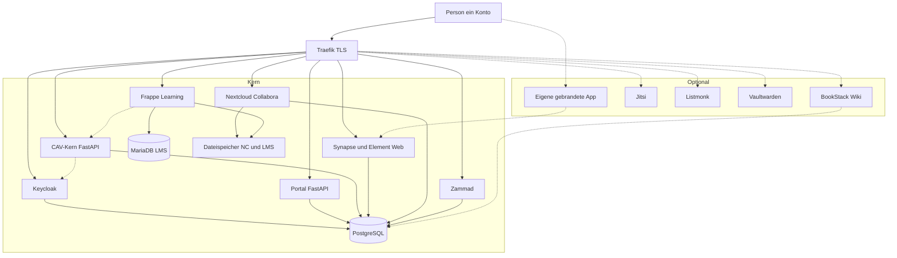

# Architektur

## Anfragefluss

Eigener Code nur: **Portal**, **CAV-Kern**, **Matrix-Gruppenabgleich**. Alles andere fertige Software hinter demselben Keycloak. LMS-Abschluss → CAV → Gruppe `schulung:*` in Keycloak.

**Gestrichelt / Kasten Optional:** nicht im Kern-Compose, Verein schaltet ein oder lässt weg. [optionale-module.md](optionale-module.md). Eigene App = gebrandetes Element (Web schon im Kern, Desktop/PWA/Store später) auf dem **selben** Login; kein Element X, kein MAS nur dafür. [ci-cd.md](ci-cd.md).

## Hosts

| Host | Dienst | Wer kommt rein |
| --- | --- | --- |
| `id.example` | Keycloak | alle Konten |
| `www.example` | Portal | alle Konten; Aufnahmeformular auch ohne Login |
| `cav.example` | CAV-Kern | alle, Tenant und Rolle aus Token; Fachzugriff zusätzlich `schulung:*` |
| `chat.example` | Element / Matrix | `mitgliedschaft:aktiv` **und** `schulung:chat` |
| `help.example` | Zammad | alle (Mitglied = Kunde, Amt = Agent nach Gruppe) |
| `learn.example` | Frappe Learning | `mitgliedschaft:aktiv` |
| `cloud.example` | Nextcloud + Collabora | nur Backoffice-Gruppen |
| `wiki.example` / `meet.example` / `news.example` / `pass.example` | optionale Overlays | nur wenn eingeschaltet, siehe [optionale-module.md](optionale-module.md) |
| — | eigene gebrandete App | kein extra Host; Client auf `chat.example`, optional |

## Wer darf wohin

| Rolle | Portal / CAV | Matrix | Zammad | Schulung | Nextcloud |
| --- | --- | --- | --- | --- | --- |
| pending | Antrag, kein Abgeben | nein | eigene Tickets (Kunde) | nein | nein |
| Mitglied (aktiv) | Belege; Rest nach `schulung:onboarding` / Prävention | nur mit `schulung:chat` | eigene Tickets | Onboarding, Prävention, Chat-Regeln, intern | nein |
| beendet | Belege, Historie, kein Abgeben | Kick | eigene Tickets (Kunde) | nein | nein |
| Vorstand / AP / PräVB | Amt im Tenant (plus Amtskurse) | plus Amts-Space, ebenfalls `schulung:chat` | Agent + eigene Aufgaben | plus Amtskurse | ja |
| Ausgabe / Anbau | CAV-Funktion nach `schulung:ausgabe` bzw. Dienstkurs | Diensträume | in der Regel Kunde, nicht Agent | Pflicht + Dienst | ja |
| Gesamtverein-Mitarbeiter | Mandantenwahl | Dachverband | globale Queue | Kursadmin | ja |

Feinkatalog der Türen: [schulungen.md](schulungen.md).

## Docker Compose (Einstieg)

Ein Debian- oder Ubuntu-LTS-Host, kein Kubernetes. Bei Last Zammad/Synapse/Postgres eher eigene VMs, Compose bleibt das Modell. Frappe Learning statt Moodle: MariaDB+Worker, keine Campus-VM von Tag eins; eigene VM erst bei Last.

Testserver zuerst **Kern ohne CAV-Fachlogik**: Traefik/Caddy, Keycloak, Portal, Zammad, dann LMS, Matrix, Nextcloud. CAV-Stub darf warten. Optionale Overlays danach.

| Container | Rolle | Logik |
| --- | --- | --- |
| traefik | HTTPS, Hosts | konfigurieren |
| keycloak + eigene DB | Konten, Gruppen, Clients | konfigurieren |
| synapse + element | Chat, Spaces, keine Federation | konfigurieren |
| zammad + elasticsearch/meilisearch laut Doku | Support und Amts-Tickets | konfigurieren |
| frappe-learning + MariaDB + Redis | Schulungen, Mitwirkungsnachweis (nicht Moodle) | konfigurieren |
| nextcloud + collabora + redis | Backoffice-Dateien, Kalender, Office | konfigurieren |
| portal | Linktree, Aufnahme, Mein Konto, dünne APIs | selbst schreiben |
| gruppenabgleich | Keycloak → Matrix-Spaces (inkl. `schulung:chat`) | selbst schreiben |
| cav + worker | KCanG-Kern, Multi-Tenant, SEPA-Webhooks, LMS-Abschlüsse → `schulung:*` | selbst schreiben |
| postgres / redis / restic | Daten, Jobs, Backup | konfigurieren |

Getrennte Datenbanken je Dienst. Gemeinsame Postgres-Instanz am Anfang zulässig, getrennte Databases. LMS: MariaDB daneben, nicht in denselben Postgres zwingen.

CAV spricht nicht mit Nextcloud für Mitglieder-PDFs. Zammad hält Tickets. Frappe Learning hält Kurse. CAV hält Nachweise und Türen. Portal verlinkt und zeigt unter Mein Konto Beitrag, Tokens und grob den Schulungsstatus. Amts-Ablage nur Nextcloud, kein zweites Archiv.

Zahlungsdienst: [beitrag-sepa.md](beitrag-sepa.md). Tickets: [tickets.md](tickets.md). Schulung: [schulungen.md](schulungen.md). Overlays: [optionale-module.md](optionale-module.md).

## Mandanten

Ein CAV-Prozess, viele Zweigvereine **oder** genau einer — dieselbe YAML. Jede fachliche Zeile mit `verein_id`. Zammad-Organisationen spiegeln denselben Verein, führend bleibt Keycloak. LMS eine Instanz, keine 180 Schulungsplattformen.

Jedes Zweigverein ist rechtlich eigene Anbauvereinigung (Erlaubnis, 500er-Grenze, Bestand, Jahresmeldung). Keine Bestandsvermischung.

Ausgliedern und Wiederbeitritt: Datenpaket, [mandanten.md](mandanten.md). Kein zweites Produkt „Aeneas Solo“.

## Frontends

Portal und CAV: FastAPI plus HTML-Templates. Zammad, Frappe Learning, Element Web, Nextcloud (plus optionales BookStack/Jitsi): deren eigene UI, SSO. Mitglieder sehen Aufnahme und Schulungsstatus im Portal, nicht als Zammad-Ticketmaske. Chat bleibt Element Web mit Keycloak; eine eigene gebrandete App ist optional und ändert den Server nicht.
